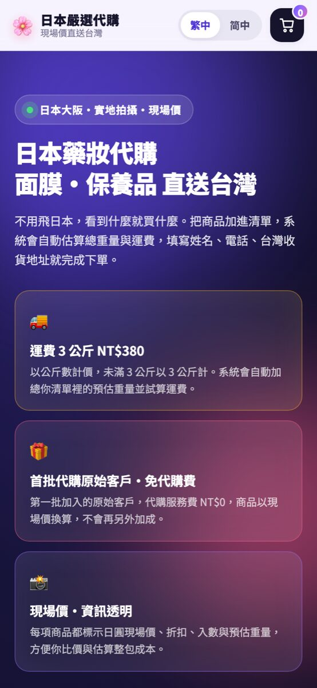
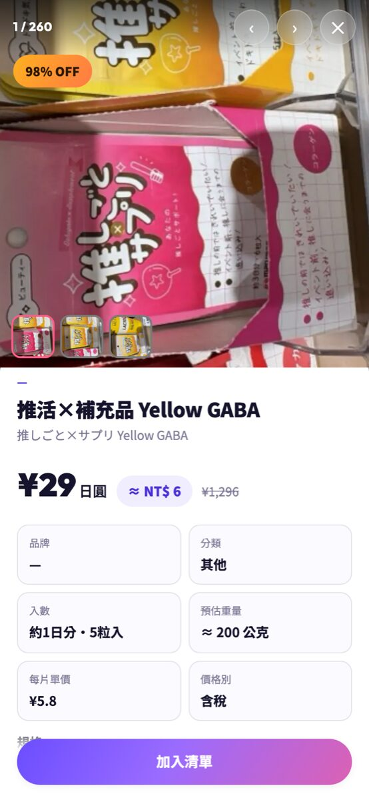
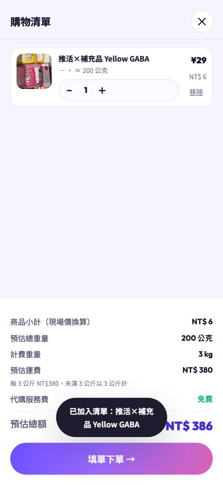
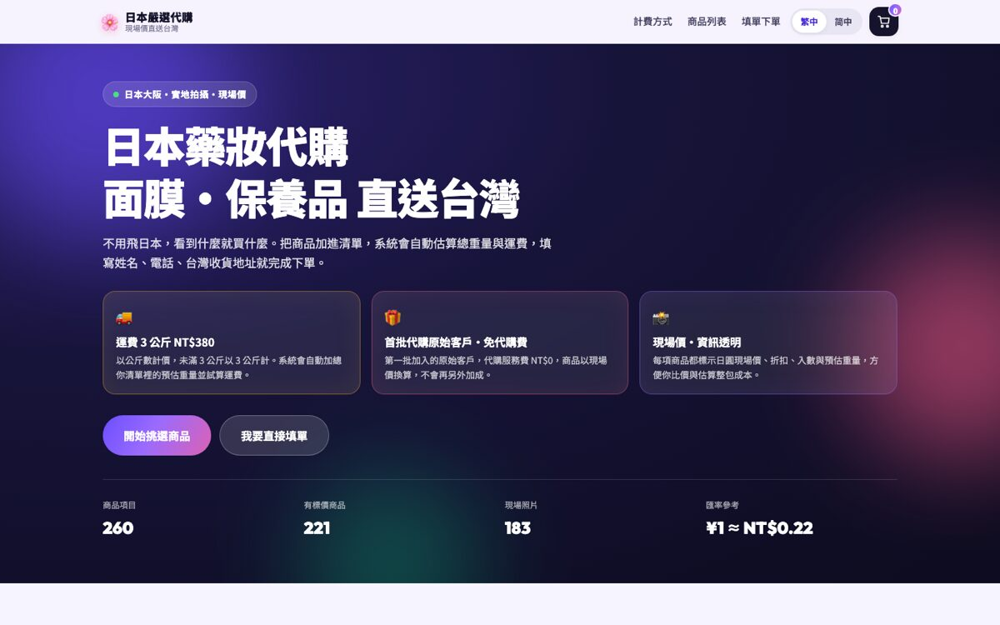
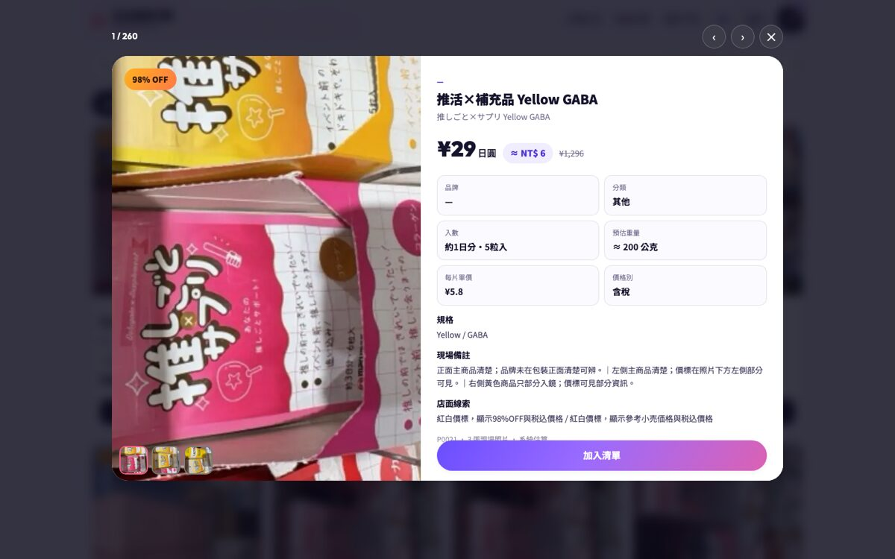

# 日本嚴選代購｜一頁式下單網站

日本實地拍攝的藥妝／面膜商品，做成一個手機優先的一頁式代購網站：

- **運費：每 3 公斤 NT$380**（未滿 3 公斤以 3 公斤計）
- **首批代購原始客戶：免代購費**（服務費 NT$0）
- 消費者只要填 **姓名、電話、台灣收貨地址** 就能送出
- 系統依 Excel 重量表 **自動加總每一包的預估重量並試算運費**
- 送出後 **自動寄信到 `cia8885@gmail.com`**
- **繁體中文／簡體中文** 雙語切換（含商品說明）
- 網頁最後明確註明：**實際報價一律以客服最後確認為準**

商品資料來源：Google 雲端硬碟 `日本面膜_商品資料庫_2026-09-30`（260 項商品、183 張現場照片）。

## 畫面預覽

| 手機首頁 | 手機商品頁（一屏一商品） | 手機購物清單 |
|---|---|---|
|  |  |  |

| 桌面首頁 | 桌面商品頁 |
|---|---|
|  |  |


---

## 目錄結構

```
public/                 # 前端（純靜態，無框架）
  index.html            # 一頁式主頁
  css/style.css         # 設計系統與全部樣式
  js/i18n.js            # 繁中／簡中字典
  js/app.js             # 商品瀏覽、重量試算、購物清單、表單送出
  data/products.json    # 由 Excel 產生的商品資料（含預估重量、估算台幣）
  img/t/ img/p/         # 縮圖 / 大圖（webp）
  404.html
server/
  index.js              # Express：靜態網站 + POST /api/order
  order.js              # 驗證、金額重算、Email 內容產生
  mailer.js             # SMTP → FormSubmit 代理 → 失敗
scripts/
  build-data.mjs        # CSV → JSON + Excel 重量表
  build-images.mjs      # 照片 → webp（縮圖 / 大圖）
  weight-model.mjs      # 預估重量模型（可調係數）
data/
  source/               # 原始 products.csv 與 183 張縮圖
  商品重量表.xlsx        # 可用 Excel 直接檢視／調整係數與公式
tests/order.test.js     # 運費、金額、驗證、Email 內容的單元測試
render.yaml             # Render 部署設定
```

## 快速開始

```bash
npm install
npm run build      # 重新產生商品資料與圖片（資料已隨 repo 附上，通常不需要）
npm start          # http://localhost:3000
npm test           # 單元測試
```

開發時可 `npm run dev`（檔案變更自動重啟）。

## 重量估算方式

資料庫只有「入數（枚）」與「分類」，沒有實秤重量，因此以公式估算每一包的重量：

```
預估重量(g) = ROUND((入數 × 每片重量 + 包裝基準) / 5) × 5      （未滿 30 g 以 30 g 計）
```

| 分類 | 包裝基準(g) | 每片(g) |
|---|---|---|
| 面膜 | 20 | 22 |
| 眼膜 | 18 | 8 |
| 精華 | 150 | — |
| 化妝水 | 260 | — |
| 乳液 | 230 | — |
| 洗面乳 | 150 | — |
| 其他 | 200 | — |

係數在 `scripts/weight-model.mjs`，也可直接在 `data/商品重量表.xlsx` 檢視每一項的計算過程。

## 費用試算規則

| 項目 | 規則 |
|---|---|
| 商品小計 | 現場價（税抜商品自動 ×1.1 換算含稅）× 匯率（預設 `¥1 = NT$0.22`）× 數量 |
| 運費 | `ceil(總重 / 3kg) × NT$380`，未滿 3 公斤以 3 公斤計 |
| 代購服務費 | 首批原始客戶 **NT$0** |
| 未標價商品 | 顯示「現場未標價，客服另行報價」，不列入小計 |

匯率可用環境變數 `JPY_TO_TWD` 覆寫後執行 `npm run build:data`。
金額一律由**伺服器重算**，不信任前端傳來的數字。

## 寄信設定（重要）

訂單一律寄到 `cia8885@gmail.com`，依部署方式有兩條路徑，前端會**自動偵測**要用哪一條：

### A. 目前線上部署（Render 靜態站台）— 瀏覽器直送

靜態站台沒有後端，送出表單時會由瀏覽器直接把訂單送到 FormSubmit，再轉寄到 `cia8885@gmail.com`。

> **第一次上線後請做一次：** 隨便送出一筆測試訂單，`cia8885@gmail.com` 會收到 FormSubmit 的**啟用信**，點下信中的啟用連結後，之後的訂單才會正常轉寄。（未啟用前送出會被 FormSubmit 擋下。）

### B. 選用：Render Web Service 後端（較穩定，不經過第三方）

若方案額度允許，可依 `render.yaml` 內註解建立 Web Service，前端偵測到 `/api/health` 就會自動改走後端。後端寄送順序：

1. **SMTP**（最穩定）— 在 Render 後台設定環境變數：

   | 變數 | 值 |
   |---|---|
   | `GMAIL_USER` | `cia8885@gmail.com` |
   | `GMAIL_APP_PASSWORD` | Gmail **應用程式密碼**（16 碼，非登入密碼） |

   應用程式密碼產生：Google 帳號 → 安全性 → 兩步驟驗證 → 應用程式密碼。

   也可改用自架 SMTP：`SMTP_HOST` / `SMTP_PORT` / `SMTP_USER` / `SMTP_PASS` / `MAIL_FROM`。

2. **FormSubmit 代理** — 沒填 SMTP 時自動使用（同樣需要先啟用）。
3. 兩者都失敗 → 前端改由瀏覽器直接呼叫 FormSubmit，並在畫面提示客服信箱。

## API

| 方法 | 路徑 | 說明 |
|---|---|---|
| `GET` | `/api/health` | 健康檢查（含是否已設定 SMTP） |
| `POST` | `/api/order` | 送出代購需求，成功回傳 `{ ok, ref, transport, totals }` |

`POST /api/order` 內含：必填驗證、單品數量上限 99、單筆最多 200 項、每 IP 10 分鐘 20 次的流量限制。

## 部署

### GitHub

<https://github.com/809540023-lgtm/jp-mask-daigou>（main 分支）

```bash
git remote add origin https://github.com/809540023-lgtm/jp-mask-daigou.git
git push -u origin main
```

### Render（目前線上）

- **網址：<https://jp-mask-daigou-static.onrender.com>**
- 類型：Static Site（免費方案）
- Build Command：`npm ci && npm run build:static`
- Publish Directory：`public`
- 已設定 `autoDeploy`，push 到 `main` 就會自動重新部署。

要用 Blueprint 重建：Render Dashboard → **New → Blueprint** → 選這個 repo（會讀取 `render.yaml`）。

> 註：Render 免費額度用罄時無法建立免費 Web Service；此時靜態站台 + 瀏覽器直送 FormSubmit 已經可以完整運作，之後額度允許再依 `render.yaml` 註解開啟後端即可。

## 注意事項

- 價格、重量、運費都是**系統估算**；頁面與 Email 皆載明「實際報價以客服最後確認為準」。
- 照片與價格來自現場價標，`confidence` 偏低的商品會標示「待複核」。
- Render 免費方案檔案系統是暫時性的，`data/orders.jsonl` 僅供除錯用，正式紀錄以 Email 為準。
- 依 Canva／各平台條款與著作權，本站僅使用自有拍攝的照片與自有商品資料。
